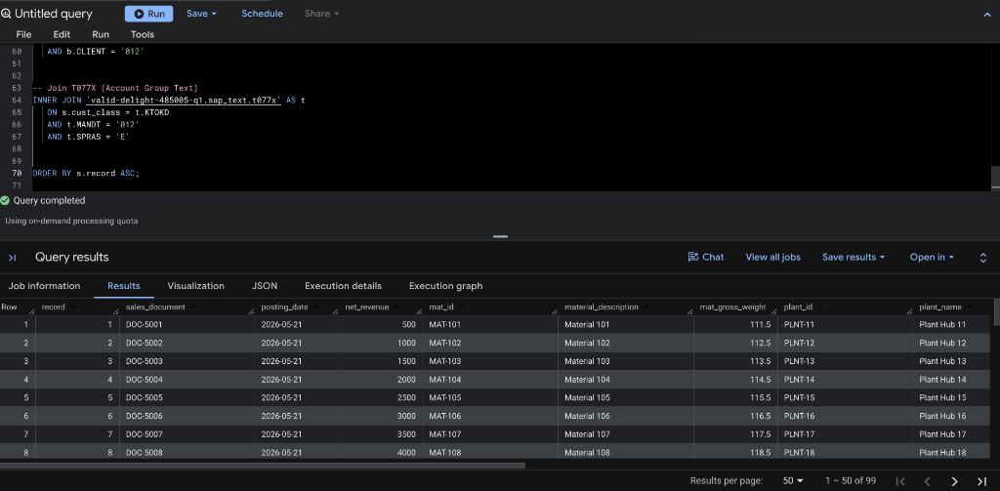
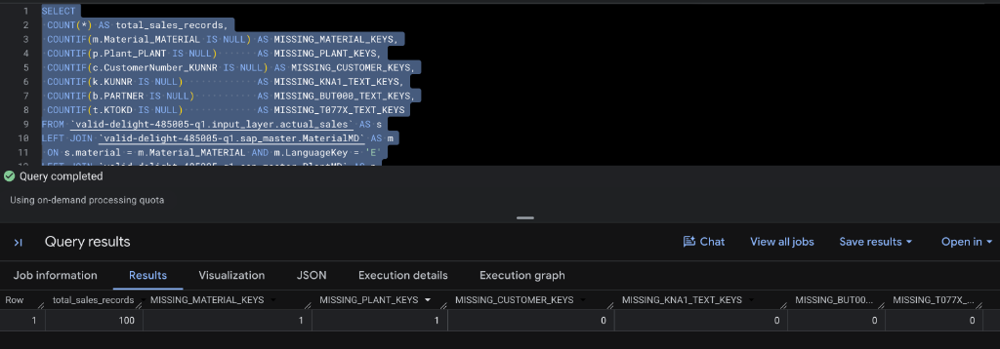
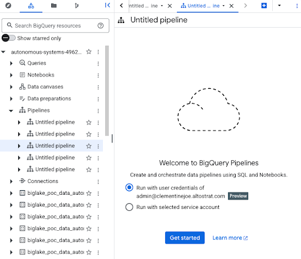
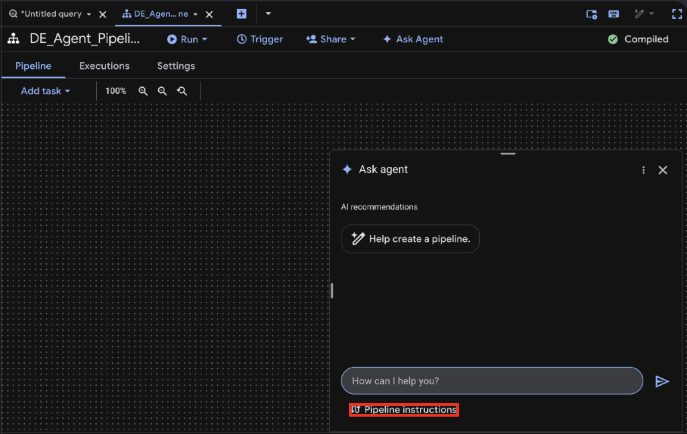

author: Google Cloud Data Engineering Team
id: bigquery-data-engineering-codelab
summary: A comprehensive, hands-on course for setting up, populating, and validating a structured data pipeline architecture in Google Cloud BigQuery.
categories: Data Engineering, BigQuery, Google Cloud
environments: Web
status: Published
feedback link: https://github.com/your-repo/issues

# Codelab: Demonstrating the Data Engineering Agent in BigQuery

## Overview
Welcome to this comprehensive course showcasing the capabilities of the **Data Engineering (DE) Agent** in Google Cloud! 

**The Origin of the Data Engineering Agent**
Recently introduced as a core pillar of Google Cloud's AI-driven data ecosystem, the Data Engineering Agent is deeply powered by Google's state-of-the-art Gemini foundational models. Born out of the need to reduce the operational overhead on data engineering teams, it was built specifically to understand deep data contexts, enterprise schemas, and complex transformation logic. By integrating directly into the BigQuery and Dataform workspaces, it bridges the gap between high-level business logic and low-level pipeline execution.

**Core Capabilities of the Data Engineering Agent**
The Data Engineering Agent is designed to revolutionize how data professionals build, manage, and scale data pipelines. Its robust capabilities include:
* **Natural Language to Pipeline Code**: Seamlessly translates plain-English requirements into production-grade SQL and complex Dataform configurations.
* **Context-Aware Schema Operations**: Intelligently analyzes existing table structures to autonomously determine optimal join keys, cast data types, and apply transformations without manual mapping.
* **Automated Data Quality & Assertions**: Proactively generates and enforces data quality checks (such as null-checks and uniqueness) to maintain downstream data integrity.
* **Pipeline Debugging and Course Correction**: Capable of ingesting error logs and user feedback to dynamically refactor and fix broken SQL logic on the fly.
* **Architectural Governance**: Autonomously enforces industry best practices—such as proper table partitioning and structured data layering.

The primary purpose of this codelab is to **demonstrate the Data Engineering Agent in action**. We will use the agent to collaboratively design, set up, and validate a robust data pipeline architecture using a robust, layered data approach. 

By establishing a baseline environment and then prompting the Data Engineering Agent, we will guide you step-by-step through:
1. Safely cleaning up and initializing our foundational data environment.
2. Generating synthetic mock data and preparing the initial source schemas.
3. Utilizing the Data Engineering Agent to systematically generate Dataform pipeline modules (from raw to final layers).
4. Iteratively refining pipelines, validating integrity, and enforcing data quality through AI-assisted engineering.

## What You'll Learn
* **AI-Assisted Data Engineering**: How to effectively interact with the Data Engineering Agent using modular prompts to generate complex data pipelines.
* **Agent Capabilities**: Discover what the Data Engineering Agent can do—from automated schema transformations and data standardization to intelligent table joins and logic corrections.
* **Production Dataform Frameworks**: Implementing the Data Engineering Agent alongside Google Cloud Dataform to build auditable, dependency-driven data workflows.
* **Prompt Engineering for DE**: Best practices for structuring prompts to ensure the agent writes code that complies with strict data governance and relational standards.


## Environment Architecture Overview
### Overview of the Transformation
We are going to enrich the actual sales data from the SAP system with master data and text files to make it accessible and easily understood for business users.

Before we begin writing any code, it is critical to understand the layout of our datasets and tables. A well-organized environment prevents confusion and enforces data governance. 

Our data environment is structured into specific layers and domains as follows:

| Layer / Purpose | Dataset | Table Name | Description |
| :--- | :--- | :--- | :--- |
| **Source (Raw SAP)** | `input_layer` | `actual_sales` | Contains the raw, uncleaned transactional sales data extracted from SAP.<br>Acts as the foundational raw layer for our pipeline. |
| **Target** | `final_layer` | `actual_sales_step1`, `actual_sales_step2`, `actual_sales_step3` | Holds the refined, enriched, and aggregated sales models.<br>Represents the final refined tiers for business reporting. |
| **Master Data** | `sap_master` | `MaterialMD`, `PlantMD`, `CustomerMD` | Stores key dimensional attributes for materials, plants, and customers.<br>Used to enrich raw transactions with contextual meaning. |
| **Text Enrichment** | `sap_text` | `kna1`, `but000`, `t077x` | Provides human-readable localization strings and text descriptions.<br>Ensures that final reports are easily understood by business users. |

Take a moment to familiarize yourself with these datasets. The `input_layer` acts as our raw ingestion layer, capturing raw data, while the `final_layer` will serve as our final refined layers.

---

## Environment Cleanup
### ✅ Important Prerequisite: Set Your Project ID
Throughout this codelab, you will see the placeholder `<YOUR_PROJECT_ID>` in SQL queries and configuration files. 

**Interactive Feature:** 
Look at the **top right corner** of this page! We've added a custom text box for you. Simply type your actual Google Cloud Project ID into the box and click **Apply**. This will instantly and automatically update all the code snippets on this page for you!

---

### Executing the Cleanup

To ensure a clean deployment and avoid conflicts with any legacy schema versions, our first step is to clean the slate.

By dropping existing tables before recreation, we guarantee that our pipeline starts from a known, predictable state.

Run the following standard BigQuery SQL commands in your Bigquery studio:

```sql
-- 1. CLEANUP: Resetting the environment to a pristine state
-----------------------------------------------------------------------------------------
DROP SCHEMA IF EXISTS `<YOUR_PROJECT_ID>.input_layer` CASCADE;
DROP SCHEMA IF EXISTS `<YOUR_PROJECT_ID>.sap_master` CASCADE;
DROP SCHEMA IF EXISTS `<YOUR_PROJECT_ID>.sap_text` CASCADE;
DROP SCHEMA IF EXISTS `<YOUR_PROJECT_ID>.final_layer` CASCADE;
-----------------------------------------------------------------------------------------
```

## Schema Definition
With our environment clear, we transition to the schema definition phase. Here, we use Data Definition Language (DDL) to explicitly define the structural properties of our tables. 

Each schema is tailored to handle specific data grain domains—ranging from transaction facts (sales) to descriptive dimensions (material, plant, and customer master data).

### Create Datasets
Before we can construct our tables, we must initialize the logical datasets that will house them. Execute the following to create the required datasets.

```sql
CREATE SCHEMA IF NOT EXISTS `<YOUR_PROJECT_ID>.input_layer`;
CREATE SCHEMA IF NOT EXISTS `<YOUR_PROJECT_ID>.sap_master`;
CREATE SCHEMA IF NOT EXISTS `<YOUR_PROJECT_ID>.sap_text`;
CREATE SCHEMA IF NOT EXISTS `<YOUR_PROJECT_ID>.final_layer`;
```

### Create Tables
Execute these DDL statements to construct your database structures:

```sql
-- 2. CREATE TABLES: Defining schemas with 25+ attributes each
-----------------------------------------------------------------------------------------

-- MATERIAL MASTER DATA
CREATE TABLE `<YOUR_PROJECT_ID>.sap_master.MaterialMD` (
  Material_MATERIAL STRING, LanguageKey STRING, Material_MATERIAL_T STRING, MaterialType_MATL_TYPE STRING, MaterialGroup_MATL_GROUP STRING,
  BaseUnit STRING, GrossWeight NUMERIC, NetWeight NUMERIC, WeightUnit STRING, Volume NUMERIC, VolumeUnit STRING, IndustrySector STRING,
  CreatedBy STRING, CreatedOn DATE, ChangedBy STRING, LastChangedOn DATE, Division STRING, ProductHierarchy STRING, Brand STRING,
  EAN_UPC STRING, ExternalMatGroup STRING, Manufacturer STRING, MfrPartNum STRING, DeletionFlag STRING, MaterialCategory STRING
);

-- CUSTOMER MASTER DATA
CREATE TABLE `<YOUR_PROJECT_ID>.sap_master.CustomerMD` (
  Client_MANDT STRING, CustomerNumber_KUNNR STRING, Name1_NAME1 STRING, Name2_NAME2 STRING, CountryKey_LAND1 STRING,
  City_ORT01 STRING, PostalCode_PSTLZ STRING, Region_REGIO STRING, Street_STRAS STRING, Phone_TELF1 STRING, Fax_TELFX STRING,
  AccountGroup_KTOKD STRING, Industry_BRSCH STRING, CreatedOn_ERDAT DATE, CreatedBy_ERNAM STRING, DeletionFlag_LOEVM STRING,
  TaxNum1_STCD1 STRING, TaxNum2_STCD2 STRING, Language_SPRAS STRING, TradingPartner_VBUND STRING, VatRegNum_STCEG STRING,
  NielsenID_NIELS STRING, District_ORT02 STRING, CustomerClass_KUKLA STRING, AuthorizationGroup_BEGRU STRING
);

-- PLANT MASTER DATA
CREATE TABLE `<YOUR_PROJECT_ID>.sap_master.PlantMD` (
  Plant_PLANT STRING, LanguageKey STRING, Plant_PLANT_T STRING, FactoryCalendar STRING, Name2 STRING, HouseNum STRING,
  Street STRING, PoBox STRING, PostalCode STRING, City STRING, Country STRING, Region STRING, TaxJurisdiction STRING,
  PurchasingOrg STRING, SalesOrg STRING, DistChannel STRING, Division STRING, Category STRING, BatchMgmt STRING,
  SourceList STRING, ReqPlanning STRING, ValuationArea STRING, CustomerNum STRING, VendorNum STRING, MaintenancePlant STRING
);

-- TEXT ENRICHMENT TABLES
CREATE TABLE `<YOUR_PROJECT_ID>.sap_text.kna1` (
  MANDT STRING, KUNNR STRING, NAME1 STRING, LAND1 STRING, ORT01 STRING, PSTLZ STRING, REGIO STRING, STRAS STRING, TELF1 STRING, TELFX STRING,
  KTOKD STRING, BRSCH STRING, ERDAT DATE, ERNAM STRING, LOEVM STRING, STCD1 STRING, STCD2 STRING, SPRAS STRING, VBUND STRING, STCEG STRING,
  NIELS STRING, ORT02 STRING, KUKLA STRING, BEGRU STRING, ADRNR STRING
);

CREATE TABLE `<YOUR_PROJECT_ID>.sap_text.but000` (
  CLIENT STRING, PARTNER STRING, TYPE STRING, BP_CATEGORY STRING, BP_GROUP STRING, NAME_ORG1 STRING, NAME_ORG2 STRING,
  NAME_LAST STRING, NAME_FIRST STRING, TITLE STRING, LANGU STRING, SEARCHTERM1 STRING, SEARCHTERM2 STRING,
  BIRTH_DATE DATE, VALID_FROM DATE, VALID_TO DATE, NATION STRING, HOUSE_NUM STRING, STREET STRING, CITY STRING,
  POSTAL_CODE STRING, COUNTRY STRING, REGION STRING, TEL_NUMBER STRING, SMTP_ADDR STRING
);

CREATE TABLE `<YOUR_PROJECT_ID>.sap_text.t077x` (
  MANDT STRING, SPRAS STRING, KTOKD STRING, TXT30 STRING, TXT15 STRING,
  F1 STRING, F2 STRING, F3 STRING, F4 STRING, F5 STRING, F6 STRING, F7 STRING, F8 STRING, F9 STRING, F10 STRING,
  F11 STRING, F12 STRING, F13 STRING, F14 STRING, F15 STRING, F16 STRING, F17 STRING, F18 STRING, F19 STRING, F20 STRING, F21 STRING
);

-- TRANSACTIONAL INPUT LAYER
CREATE TABLE `<YOUR_PROJECT_ID>.input_layer.actual_sales` (
  record INT64, doc_number STRING, material STRING, sold_to STRING, plant STRING, cust_class STRING, calday DATE,
  _bic_bill_date DATE, bic_inv_bkd NUMERIC, _s_ord_item STRING, _bic_bill_item STRING, doc_currcy STRING,
  fiscper STRING, fiscyear STRING, salesorg STRING, distr_chan STRING, division STRING,
  zs_netrev NUMERIC, zs_taxamt NUMERIC, zs_grossamt NUMERIC, unit_of_wt STRING, nt_wt_kg NUMERIC,
  gr_wt_kg NUMERIC, opflag STRING, created_by STRING
);
-----------------------------------------------------------------------------------------
```


## Populate Mock Data
Developing and testing data pipelines often requires realistic datasets. However, relying on production data during development poses security risks and operational bottlenecks. 

To bypass this, we will use BigQuery's powerful array generation mechanics (`UNNEST(GENERATE_ARRAY(...))`) to synthetically construct mock transaction history and master data. This ensures we have a fully functional, self-contained test environment.

Execute the following script to systematically generate 100 synchronized entities across all domains:

```sql
-- 3. POPULATE DATA: Generating synthetic records for testing
-----------------------------------------------------------------------------------------

-- Populate Material Master (IDs: MAT-100 to MAT-199)
INSERT INTO `<YOUR_PROJECT_ID>.sap_master.MaterialMD` (Material_MATERIAL, LanguageKey, Material_MATERIAL_T, GrossWeight, NetWeight, WeightUnit)
SELECT CONCAT('MAT-', CAST(i AS STRING)), 'E', CONCAT('Material ', CAST(i AS STRING)), CAST(10.5 + i AS NUMERIC), CAST(9.0 + i AS NUMERIC), 'KG'
FROM UNNEST(GENERATE_ARRAY(100, 199)) AS i;

-- Populate Customer Master (IDs: CUST-1001 to CUST-1100)
INSERT INTO `<YOUR_PROJECT_ID>.sap_master.CustomerMD` (Client_MANDT, CustomerNumber_KUNNR, Name1_NAME1, CountryKey_LAND1, AccountGroup_KTOKD)
SELECT '012', CONCAT('CUST-', CAST(i AS STRING)), CONCAT('Cust Name ', CAST(i AS STRING)), 'US', '0001'
FROM UNNEST(GENERATE_ARRAY(1001, 1100)) AS i;

-- Populate Plant Master (IDs: PLNT-10 to PLNT-109)
INSERT INTO `<YOUR_PROJECT_ID>.sap_master.PlantMD` (Plant_PLANT, LanguageKey, Plant_PLANT_T, Country)
SELECT CONCAT('PLNT-', CAST(i AS STRING)), 'E', CONCAT('Plant Hub ', CAST(i AS STRING)), 'US'
FROM UNNEST(GENERATE_ARRAY(10, 109)) AS i;

-- Populate KNA1 Customer Localization Text
INSERT INTO `<YOUR_PROJECT_ID>.sap_text.kna1` (MANDT, KUNNR, NAME1, LAND1)
SELECT '012', CONCAT('CUST-', CAST(i AS STRING)), CONCAT('Legal Ent ', CAST(i AS STRING)), 'US'
FROM UNNEST(GENERATE_ARRAY(1001, 1100)) AS i;

-- Populate BUT000 Business Partner Context
INSERT INTO `<YOUR_PROJECT_ID>.sap_text.but000` (CLIENT, PARTNER, NAME_ORG1, BP_GROUP)
SELECT '012', CONCAT('CUST-', CAST(i AS STRING)), CONCAT('BP Org ', CAST(i AS STRING)), 'GRP1'
FROM UNNEST(GENERATE_ARRAY(1001, 1100)) AS i;

-- Populate T077X Account Group Definitions
INSERT INTO `<YOUR_PROJECT_ID>.sap_text.t077x` (MANDT, SPRAS, KTOKD, TXT30)
VALUES ('012', 'E', '0001', 'Standard Customer');

-- Populate Base Actual Sales Records (Mapped dynamically to valid entities)
INSERT INTO `<YOUR_PROJECT_ID>.input_layer.actual_sales` (record, doc_number, material, sold_to, plant, cust_class, calday, _bic_bill_date, zs_netrev, bic_inv_bkd, zs_taxamt, zs_grossamt, nt_wt_kg, gr_wt_kg)
SELECT
  i, 
  CONCAT('DOC-', CAST(5000+i AS STRING)), 
  CONCAT('MAT-', CAST(100+i AS STRING)), 
  CONCAT('CUST-', CAST(1000+i AS STRING)),
  CONCAT('PLNT-', CAST(10+i AS STRING)), 
  '0001', 
  CURRENT_DATE(), 
  CURRENT_DATE(),
  CAST(500.00 * i AS NUMERIC), 
  CAST(1.0 * i AS NUMERIC), 
  CAST(50.0 * i AS NUMERIC), 
  CAST(550.0 * i AS NUMERIC), 
  CAST(9.0 + i AS NUMERIC), 
  CAST(10.5 + i AS NUMERIC)
FROM UNNEST(GENERATE_ARRAY(1, 100)) AS i;
-----------------------------------------------------------------------------------------
```

---

## Verification & Validation Testing


### Test 1: Simulate Final Reporting View (End-to-End Traceability)
This query simulates a standard reporting view by joining the raw sales data with the master data tables. We use `INNER JOIN`s to ensure that we only extract sales records that have complete and matching master data dimensions (such as material, plant, and customer details). This provides a clean, unified view of our raw input data. *(Note: Because we intentionally designed the mock data to test data integrity, this query should return 99 records out of the 100 sales records).*

```sql
SELECT
  -- Transactional Data
  s.record,
  s.doc_number AS sales_document,
  s.calday AS posting_date,
  s.zs_netrev AS net_revenue,
  -- Material Master Data
  m.Material_MATERIAL AS mat_id,
  m.Material_MATERIAL_T AS material_description,
  m.GrossWeight AS mat_gross_weight,
  -- Plant Master Data
  p.Plant_PLANT AS plant_id,
  p.Plant_PLANT_T AS plant_name,
  -- Customer Master & Text Data
  c.CustomerNumber_KUNNR AS customer_id,
  k.NAME1 AS customer_legal_name,
  b.NAME_ORG1 AS business_partner_org,
  -- Account Group Text
  t.TXT30 AS account_group_desc
FROM `<YOUR_PROJECT_ID>.input_layer.actual_sales` AS s
INNER JOIN `<YOUR_PROJECT_ID>.sap_master.MaterialMD` AS m
  ON s.material = m.Material_MATERIAL AND m.LanguageKey = 'E'
INNER JOIN `<YOUR_PROJECT_ID>.sap_master.PlantMD` AS p
  ON s.plant = p.Plant_PLANT AND p.LanguageKey = 'E'
INNER JOIN `<YOUR_PROJECT_ID>.sap_master.CustomerMD` AS c
  ON s.sold_to = c.CustomerNumber_KUNNR AND c.Client_MANDT = '012'
INNER JOIN `<YOUR_PROJECT_ID>.sap_text.kna1` AS k
  ON s.sold_to = k.KUNNR AND k.MANDT = '012'
INNER JOIN `<YOUR_PROJECT_ID>.sap_text.but000` AS b
  ON s.sold_to = b.PARTNER AND b.CLIENT = '012'
INNER JOIN `<YOUR_PROJECT_ID>.sap_text.t077x` AS t
  ON s.cust_class = t.KTOKD AND t.MANDT = '012' AND t.SPRAS = 'E'
ORDER BY s.record ASC;
```

**Expected Result:**



### Test 2: Orphaned Record Diagnostic (Relational Integrity Check)
This query uses `LEFT JOIN`s to identify sales records missing corresponding master data.

> **Expected Result:** We intentionally omitted some master data. You should see `1` for both `MISSING_MATERIAL_KEYS` and `MISSING_PLANT_KEYS`, confirming the query successfully catches missing foreign keys. The other fields (like `MISSING_CUSTOMER_KEYS` and text keys) will show `0`, indicating complete and perfectly matched data for those dimensions.

```sql
SELECT
  COUNT(*) AS total_sales_records,
  -- A count > 0 indicates missing joining keys in the specified dimension!
  COUNTIF(m.Material_MATERIAL IS NULL) AS MISSING_MATERIAL_KEYS,
  COUNTIF(p.Plant_PLANT IS NULL) AS MISSING_PLANT_KEYS,
  COUNTIF(c.CustomerNumber_KUNNR IS NULL) AS MISSING_CUSTOMER_KEYS,
  COUNTIF(k.KUNNR IS NULL) AS MISSING_KNA1_TEXT_KEYS,
  COUNTIF(b.PARTNER IS NULL) AS MISSING_BUT000_TEXT_KEYS,
  COUNTIF(t.KTOKD IS NULL) AS MISSING_T077X_TEXT_KEYS
FROM `<YOUR_PROJECT_ID>.input_layer.actual_sales` AS s
LEFT JOIN `<YOUR_PROJECT_ID>.sap_master.MaterialMD` AS m
  ON s.material = m.Material_MATERIAL AND m.LanguageKey = 'E'
LEFT JOIN `<YOUR_PROJECT_ID>.sap_master.PlantMD` AS p
  ON s.plant = p.Plant_PLANT AND p.LanguageKey = 'E'
LEFT JOIN `<YOUR_PROJECT_ID>.sap_master.CustomerMD` AS c
  ON s.sold_to = c.CustomerNumber_KUNNR AND c.Client_MANDT = '012'
LEFT JOIN `<YOUR_PROJECT_ID>.sap_text.kna1` AS k
  ON s.sold_to = k.KUNNR AND k.MANDT = '012'
LEFT JOIN `<YOUR_PROJECT_ID>.sap_text.but000` AS b
  ON s.sold_to = b.PARTNER AND b.CLIENT = '012'
LEFT JOIN `<YOUR_PROJECT_ID>.sap_text.t077x` AS t
  ON s.cust_class = t.KTOKD AND t.MANDT = '012' AND t.SPRAS = 'E';
```

**Expected Result:**


---

## Setting Up Data Engineering Agent
In modern data engineering, managing SQL scripts manually is prone to error and difficult to track. This section outlines the governance framework and specific script configurations required to modernize and enrich SAP BW tables using **Google Cloud Dataform**, a service designed to manage data transformations in BigQuery.

### Part 1: The Production Framework (Standards & Protocol)
All subsequent Dataform modules must adhere strictly to the following architectural standards and execution behaviors to maintain code quality.

### Open BigQuery in GCP Console
Navigate to the Google Cloud Console, select your project, and open the **BigQuery** console from the navigation menu.
In the BigQuery explorer sidebar, look for the **Pipelines** dropdown menu. Click the three dots (options menu) next to Pipelines and select **Create pipeline**.


When a pipeline is created, it will ask for credentials. Choose the first option ("Run with user credentials") and click **Get started**.



### Rename Pipeline and Start Agent
Organization is key. Click on the "Untitled pipeline" text located just beside the **Run** button at the top, and give it a meaningful name, such as **DE_Agent_Pipeline**. Once renamed, click on `Ask Agent` in the top menu to initiate our AI-assisted workflow.


A prompt window will open at the bottom of the screen. First, click on **Pipeline instructions**. In the resulting popup, click **Create Instructions file**, which will open a new context window for the `GEMINI.md` file.



**Why GEMINI.md?**
The `GEMINI.md` file serves as the core instruction manual for the Data Engineering Agent. Instead of writing SQL yourself, you provide the agent with the "big picture"—including architectural goals, technical context (like dataset names and source schemas), and strict Dataform best practices. By defining these global rules upfront, you ensure that every piece of code the agent generates is consistent, adheres to the architectural goals, and meets production-grade governance standards without needing to be manually corrected later.

**What's in these instructions?**
This block acts as the strategic blueprint for the agent. It sets the agent's persona as a Lead GCP Data Engineer, maps out the technical landscape (source and target datasets), enforces Dataform best practices (such as dependency management and assertions), and establishes a strict step-by-step execution protocol so the agent doesn't rush ahead.

Copy the comprehensive instruction block below into the file and save it. **Make sure to replace all instances of `<YOUR_PROJECT_ID>` with your actual Google Cloud Project ID.** These rules ensure the agent writes code that complies with our Dataform standards:

```text
Objective: Act as a Lead GCP Data Engineer. Develop a production-grade suite of individual Dataform .sqlx files to modernize and enrich SAP BW tables in BigQuery. The goal is to build a modular, auditable, and high-performance data pipeline following a structured layered logic .
Technical Context:
Initial Source: <YOUR_PROJECT_ID>.input_layer.actual_sales
Target Dataset: final_layer
Master Data Source: <YOUR_PROJECT_ID>.sap_master
Text Data Source: <YOUR_PROJECT_ID>.sap_text
Dataform Best Practices (Required for ALL scripts):
Config Block: Use type: "table". Include the tag ["zinbobu_agent"] and a comprehensive description field summarizing the job's business purpose.
Dependency Management: Exclusively use the ref() function to establish the transformation chain: Job 1 -> Job 2 -> Job 3 -> Job 4.
Auditability: Every transformation and rename must be explained with inline SQL comments.
Data Quality: Include an assertions block in relevant scripts to check for null values in primary key columns or row uniqueness.
CRITICAL EXECUTION PROTOCOL:
Modular Execution: You are to generate code for one Job at a time only .
Pause & Wait: After completing the requested Job, you must explicitly ask me for the instruction for the next module 
No Leapfrogging: Do not generate logic for future Jobs (e.g., joins or renames) until that specific Job is requested 
```

After updating the instructions, commit and push the changes to your code repository. The interface should resemble the following:


Returning to the previous window, you should now see a confirmation indicating `one instruction file added`. Click save to finalize the setup.


---

## Module 1: Raw Ingestion
**Goal:** In this section, our objective is to construct the foundational **Raw Ingestion Layer**. We want to simply ingest the raw transactional data from our source table into our pipeline without any complex transformations, establishing a reliable baseline.

Navigate to the pipeline canvas, open the **Ask Agent** popup, and provide the following prompt for Module 1:

```text
Module 1: Raw Ingestion (Job 1)
Instruction: Based on the common requirements provided, create the first module: actual_sales_step1.sqlx.
Task: Select all columns and rows from the actual_sales source table.
Formatting: Ensure the config block includes a description identifying this as the "Raw Ingestion Layer".
```

The agent will process your prompt and intelligently generate the corresponding SQLX pipeline code. The agent will explain the Objective, Context, Assumptions, File Changes, Pipeline Unit Testing, and Autocleaning Steps, and might also ask for your approval. Go through the details, understand what the agent is proposing, and approve it. **Note:** Once the agent completes execution, be sure to click **Apply** to save the changes, otherwise they will be lost.


Upon executing this generated pipeline, you will find that the new table `actual_sales_step1` has been successfully created under the `final_layer` dataset, maintaining a 1:1 parity with the source data.

**Module 1 Complete:** We successfully achieved our goal by prompting the agent to perform a basic `SELECT *` operation and assign the appropriate Dataform configuration. We now have a solid baseline layer ready for downstream transformations!


## Module 2: Standardization & Schema Cleaning
**Goal:** With raw data ingested, our next objective is standardizing the schema. We need to strip out confusing technical prefixes (like `_bic_`) from our column names so the data is clean and accessible for analysts.

Provide the following prompt to the agent for Module 2:

```text
Module 2: Standardization & Schema Cleaning (Job 2)
Instruction: Based on the common requirements, create actual_sales_step2.sqlx.
Dependency: This script must reference actual_sales_step1.
Task: Clean technical prefixes from all column names. Specifically, strip _bic_, bic_, or a leading _ (e.g., _bic_bill_date becomes bill_date).
Audit Requirement: For every renamed column, add an inline SQL comment -- Renamed from [Original Name].
```

Observe how the agent updates the pipeline to include the schema cleaning logic. **Note:** Once the agent completes execution, be sure to click **Apply** to save the changes, otherwise they will be lost.


After running the pipeline, the `actual_sales_step2` table is created in the `final_layer` dataset, showcasing clean, user-friendly column names.

**Module 2 Complete:** We successfully achieved our goal! By giving the agent a precise regex-style rule (strip `_bic_` etc.), it correctly parsed the raw schema and generated the exact `SELECT` statements with aliases to rename the columns. Our schema is now standardized.


## Module 3: Master Data Enrichment
**Goal:** Raw transactional data is often cryptic (e.g., storing a Material ID but not the Material Category). In this module, our objective is to enrich our transactions by automatically joining them against descriptive master datasets (Material and Plant) so we have wider context.

Provide the following prompt to build Module 3:

```text
Module 3: Master Data Enrichment (Job 3)
Instruction: Based on the common requirements, create actual_sales_step3.sqlx.
Dependency: Reference actual_sales_step2.
Join Logic (Material): LEFT JOIN with MaterialMD. Select MaterialType_MATL_TYPE, MaterialGroup_MATL_GROUP, Brand, and MaterialCategory.
Join Logic (Plant): LEFT JOIN with PlantMD. Select PurchasingOrg, Plant_PLANT_T, and Category.
Standards: Filter both joins by LanguageKey = 'E' to prevent duplicate records.
```

The agent will seamlessly weave the `LEFT JOIN` logic into our transformation chain. **Note:** Once the agent completes execution, be sure to click **Apply** to save the changes, otherwise they will be lost.


Executing this pipeline yields the `actual_sales_step3` table, now brimming with descriptive material and plant information.

**Module 3 Complete:** We successfully achieved our goal. The agent intelligently analyzed the schemas, deduced the correct join keys, and constructed complex `LEFT JOIN` logic. Our pipeline now seamlessly integrates transactional facts with broad dimensional data.


## Module 4: Human-Readable Text Enrichment
**Goal:** To complete our pipeline's final layer, our objective is to attach localization and human-readable text enrichment from our SAP text tables (such as customer names and account group descriptions). This ensures dashboards and reports are intuitive for business users.

Use the following prompt for Module 4:

```text
Module 4: Human-Readable Text Enrichment (Job 4)
Instruction: Based on the common requirements, create the final module: actual_sales_step4.sqlx.
Dependency: Reference actual_sales_step3.
Enrichment Task: Join with text tables kna1, but000, and t077x.
Text Standards: Filter all text tables by Client ('012'). Additionally, filter t077x by Language ('E').
Selection: Retrieve NAME1 from kna1, TXT30 from t077x, and text fields from but000. Use unique table aliases for each join.
```

The agent processes the final enrichment step, completing the core pipeline logic. **Note:** Once the agent completes execution, be sure to click **Apply** to save the changes, otherwise they will be lost.


**Module 4 Complete:** We achieved our goal! The agent correctly joined the text dimension tables, successfully navigating multiple text-specific filters (`Client = '012'`, `Language = 'E'`). Our final reporting layer is now complete and highly readable for BI consumers.

## Module 5: Extending Enrichment Iteratively
**Goal:** In real-world scenarios, requirements evolve, and you often need to amend previous modules. Our objective here is to demonstrate how to seamlessly request an enhancement (adding Customer Master Data) to an existing step (Module 3) without breaking the pipeline.

Provide the following prompt to enhance Module 3 with customer data:

```text
Module 5: Master Data Enrichment Extension
Instruction: Based on the common requirements, enhance actual_sales_step3.sqlx.
Dependency: Reference actual_sales_step2.
Join Logic (CustomerMD): LEFT JOIN with CustomerMD. Identify the relevant joining keys and fetch the relevant fields from CustomerMD.
Standards: Filter both joins by LanguageKey = 'E' to prevent duplicate records.
```

The agent thoughtfully refactors the pipeline graph to incorporate this new requirement. **Note:** Once the agent completes execution, be sure to click **Apply** to save the changes, otherwise they will be lost.


**Module 5 Complete:** We achieved our goal! The agent intelligently refactored `actual_sales_step3.sqlx` to include the `CustomerMD` joins, successfully navigating the evolving requirements without disrupting the dependency chain.

## Module 6: Course Corrections
**Goal:** AI agents, much like human engineers, occasionally need specific constraints reiterated. Our objective is to demonstrate the agent's debug and correction capabilities by instructing it to fix an inappropriate column rename, proving it can course-correct based on natural language feedback.

Provide the following correction prompt:

```text
Module 6: Master Data Enrichment - Correction
Instruction: Based on the common requirements, enhance actual_sales_step3.sqlx.
Dependency: Reference actual_sales_step2.
I need a correction to the script actual_sales_step3.sqlx.
Do not rename the master table columns, keep them exactly as they are.
Standards: Filter both joins by LanguageKey = 'E' to prevent duplicate records.
```

The agent applies the requested corrections, yielding a precise and compliant transformation script.


**Module 6 Complete:** We achieved our goal! The agent immediately understood the natural language feedback, modified the SQL logic to keep the exact original column names, and effectively course-corrected without requiring manual SQL debugging on our part.

---

## Alternative Prompting Method
As you become more comfortable navigating Dataform with an AI agent, you can begin feeding it more holistic, multi-step instructions. Below is an example of an advanced, comprehensive prompt that dictates the entire pipeline architecture in one go.

While single, large prompts can be highly efficient, they may require careful tuning to ensure the agent captures every nuance without hallucinations.

### Advanced Single Prompt Example
```text
Objective: Act as a Lead GCP Data Engineer. Develop a production-grade suite of individual Dataform .sqlx files to modernize and enrich SAP BW tables in BigQuery. The goal is to build a modular, auditable, and high-performance data pipeline that follows a structured layered logic.
Technical Context:
Initial Source: <YOUR_PROJECT_ID>.input_layer.actual_sales
Target Dataset: final_layer
Master Data Source: <YOUR_PROJECT_ID>.sap_master
Text Data Source: <YOUR_PROJECT_ID>.sap_text

Dataform Best Practices Requirements for ALL Scripts:
Config Block: Use type: "table". Include the tag ["zinbobu_agent"] and a comprehensive description field summarizing the job's purpose.
Dependency Management: Exclusively use the ref() function to establish the chain: Job 1 -> Job 2 -> Job 3 -> Job 4.
Auditability: Every transformation must be explained with inline SQL comments.
Data Quality: Include an assertions block in relevant scripts to check for null values in primary key columns or uniqueness.

Job-Specific Logic:
Job 1 (Ingestion Layer): Create actual_sales_step1.sqlx.
Task: Materialize a 1:1 copy of the source actual_sales.
Documentation: Tag this as the "Raw Ingestion Layer" in the config.

Job 2 (Standardization Layer): Create actual_sales_step2.sqlx.
Transformation: Standardize the schema by cleaning column names. Strip prefixes like _bic_, bic_, or leading underscores.
Rule: For every renaming, add the comment -- AUDIT: Renamed from [Original Name] next to the field.
Assertion: Check that the resulting bill_date (or equivalent) is never null.

Job 3 (Master Data Enrichment): Create actual_sales_step3.sqlx.
Join Logic: Perform LEFT JOIN operations with MaterialMD and PlantMD.
Standard master table filters: Apply a WHERE clause for LanguageKey = 'E' for both master tables to prevent row explosion.
Material Selection: Fetch MaterialType_MATL_TYPE, MaterialGroup_MATL_GROUP, Brand, and MaterialCategory.
Plant Selection: Fetch PurchasingOrg, Plant_PLANT_T, and Category.

Job 4 (Text Table Enrichment - Final Layer): Create actual_sales_step4.sqlx.
Task: Join with kna1, but000, and t077x.
Standards: Filter all text tables by Client ('012'). Additionally, filter t077x by Language ('E').
Select: Retrieve NAME1 from kna1 and TXT30 from t077x. Use unique aliases like customer_text and category_description.
Performance: Add bigquery: { partitionBy: "CLEAN_DATE_FIELD" } to the config block if a date field is available.

Output Format: Provide distinct code blocks. Clearly label each with its intended filename (e.g., actual_sales_step1.sqlx). 
Think through the logic step-by-step to ensure column name collisions are avoided.
```

Congratulations on completing the Codelab! You are now equipped with the practical knowledge to construct and manage scalable, structured data pipelines in BigQuery using Google Cloud Dataform and AI-assisted engineering.
